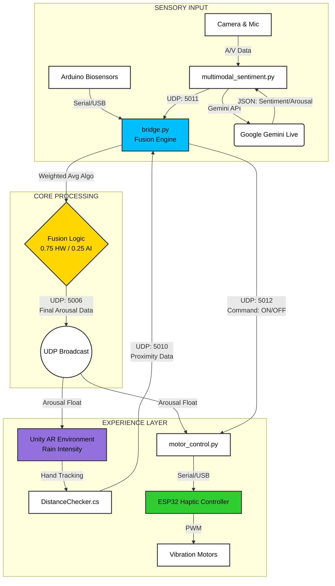

# Rain With Me 🌧️

**Winner at MIT Reality Hack 2026** A real-time biometric empathy tool that translates emotional states into immersive AR environments and haptic feedback.

## Overview
Rain With Me uses real-time biometric data and AI to bridge the empathy gap between two users. By detecting a user's emotional state (arousal and valence), the system modulates a shared AR environment and provides physical haptic feedback to a second user, allowing them to "feel" the first person's internal emotional volatility.

## The Science: Affective Computing
The core logic relies on the Circumplex Model of Affect, which maps human emotion onto two axes:
1. Arousal (Intensity): Measured via Galvanic Skin Response (GSR) and Heart Rate (PPG).
2. Valence (Positivity/Negativity): Inferred via Multimodal AI analysis of voice and facial expression.

## Tech Stack
- **Hardware:** Custom GSR & PPG sensors (Arduino/ESP32), Haptic Motors.
- **AI/ML:** Google Gemini Live API (Multimodal Sentiment Analysis).
- **Engine:** Unity AR / XR Interaction Toolkit.
- **Networking:** UDP Socket communication for low-latency (<50ms) sensor fusion.
- **Tracking:** Hand-tracking in Unity for interactive haptic feedback.

## Key Features
- **Biometric Fusion Engine:** A custom Python bridge fuses hardware data (GSR spikes) with software inference (Gemini audio/visual analysis) using a weighted algorithm (0.75 Hardware / 0.25 AI) to determine the true "intensity" of the emotion.
- **Dynamic Weather System:** Unity VFX (Rain) modulates in real-time based on the user's physiological arousal—calm users see a drizzle; stressed users create a storm.
- **Haptic Transfer:** A second user can "touch" the digital rain via hand-tracking. The system calculates the distance between the hand and the rain, triggering haptic motors to simulate the physical sensation of the other user's emotions.

## System Architecture

The system relies on a **hub-and-spoke UDP architecture** to ensure low-latency synchronization (<50ms) between the Python backend, Unity frontend, and hardware actuators.

### 1. The Sensor Layer
* **Arduino Biosensors:** An Arduino UNO reads raw analog data from an ADS1115 (GSR and Pulse) and streams it via Serial to the PC.
* **Multimodal AI:** `multimodal_sentiment.py` captures webcam frames and audio chunks, sends them to the **Google Gemini Live API**, and broadcasts the resulting valence/arousal scores to the local network.

### 2. The Fusion Engine (`bridge.py`)
This script acts as the central nervous system. It:
* **Aggregates** asynchronous streams: Serial (Biosensors), UDP 5011 (AI Data), and UDP 5010 (Hand Tracking).
* **Calculates** the "True Arousal" using a weighted algorithm:
    > `Final_Arousal = (GSR_Spike * 0.75) + (AI_Inference * 0.25)`
* **Broadcasts** the state to port `5006`, which is simultaneously read by Unity (for visuals) and the haptic controller.

### 3. The Feedback Loop
* **Visuals:** `BioReceiver.cs` in Unity reads Port 5006 and maps "Final_Arousal" to particle velocity (Rain Intensity).
* **Haptics:** `DistanceChecker.cs` in Unity tracks the distance between the user's hand and the virtual rain. When the hand "touches" the rain, it sends a proximity alert to the Python bridge.
* **Actuation:** If proximity is detected, `motor_control.py` enables the haptics, mapping the "Final_Arousal" score to vibration waveforms on the DRV2605 motor driver.

